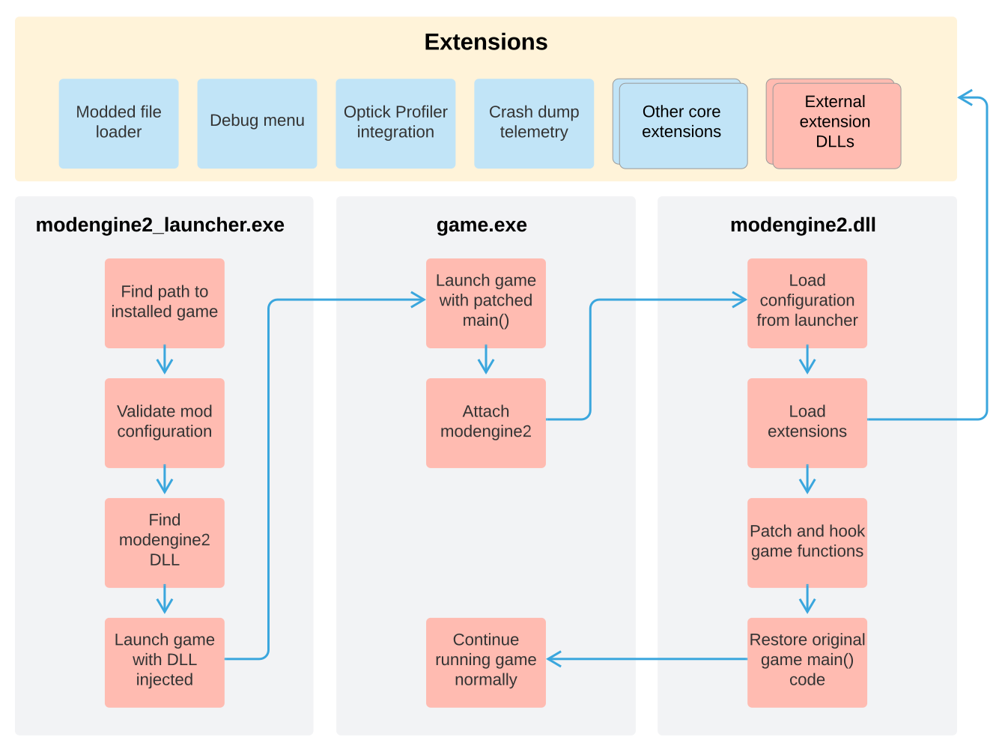

# Architecture

This document provides a high-level overview on the architecture of Mod Engine 2.

## Bird's Eye View

## Code Map

### `launcher/`

This is the source code for the Mod Engine 2 launcher.
It is a command-line application that can locate installations of games that it manages and inject the Mod Engine DLL into them.
The hooking process is completely driven by [Microsoft Detours](https://github.com/Microsoft/Detours) and is typically done by rewriting the IAT of the game on the fly
before it starts executing.

### `src/`

Core Mod Engine DLL source code.
This DLL is a framework that doesn't do a lot of work on its own, instead it delegates functionality out to extensions that can be baked into Mod Engine's core or shipped separately as external DLLs.

The core provides some basic functionality that extensions can use, like searching for patterns of bytes in memory, or replacing functions with a detour.
In addition, the core can also expose configuration options to each extension as well as disable/enable each of them individually.

### `include/`

Header files that make up the public extension API of Mod Engine 2.
Mods that want to build their own extensions as DLLs consume these to interact with the Mod Engine DLL.

### `dist/`

Assets and configuration files that are used to create distributions (e.g. installers and zip files). We store debug
menu assets, our WiX packaging scripts, and some sensible default configuration in here.

### `third-party/`

External dependencies that are not available via vcpkg ports and instead included as Git submodules.

### `tools/`

Scripts and misc. applications that make development easier.