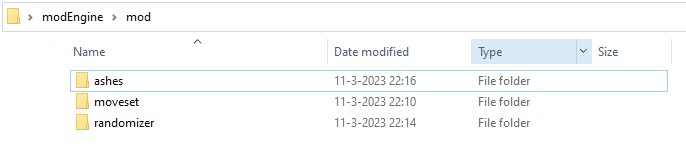

# Mod Engine 2

Mod Engine 2 is a ground up rewrite of Mod Engine, a runtime code patching and injection library used for adding modding functionality to the Souls games by FROM Software.

# Table of Contents
1. [Get started](#get-started-guide)
2. [Supported games](#supported-games)
2. [Differences](#what-are-the-differences)
3. [Features](#features)

## Get started guide

1. Download the latest [release](https://github.com/soulsmods/ModEngine2/releases).
2. Create a folder in the mod folder, I recommend the name of the mod for clarity.
3. Unpack the mod into the just created folder.
4. Edit the `eldenring_config.toml` (or your game of choice) to include the folder you just created.

```toml
mods = [
  { enabled = true, name = "default", path = "mod\\testmodName" },
  { enabled = false, name = "default", path = "mod\\disabledTestmodName" },
]
```

<details>
  <summary>Folder structure example</summary>

  

</details>

## Supported games

See the list below for information on games that currently have support in Mod Engine 2.

- [x] Dark Souls 3
- [x] Elden Ring
- [ ] Dark Souls 2: SOTF
- [ ] Dark Souls Remastered
- [ ] Sekiro: Shadows Die Twice
- [ ] Bloodborne


## What are the differences?

There are some big architecture differences between legacy Mod Engine and the new version, the bulk of which is in 1) the configuration format and 2) how we get ModEngine loaded into the game.
More details about these differences are listed below.

### New configuration format

The old `.ini` format is gone, replaced by a new structured configuration file based on [TOML](https://toml.io/en/).
This change is to suit the new extension model of Mod Engine by allowing plugins to specify their own configuration requirements.

This is used by the mod loader plugin to specify lists of mods that should be loaded and whether they should be enabled or not.
It may be extended in future to support a "Mod Manifest", which would contain additional information like website, version, authors, etc.

### Sideloading as `dinput8.dll` is optional

With the introduction of a launcher we no longer need to rely on games loading via `dinput8.dll` and we can instead launch the game pre-configured.
This frees up this module for anything else that relies on being sideloaded.

### Support for loading multiple mods

Multiple game roots can be specified in configuration, allowing users to run multiple mods concurrently without replacing files in their mod folder manually.
Note, however, that this is still restricted to mods that don't replace conflicting files.

### Focus on tooling for mod creators

The primary driver behind development of Mod Engine 2 is creating a tool that can be used to rapidly reverse the games that we are interested in.
To this end, we offer functionality to make the reversing process easier:

- Integration with Optick Profiler
- Runtime scripting and live code patching
- Crash dumps for all users

## Features

Mod Engine 2 covers all existing functionality from the original Mod Engine for Dark Souls but introduces some important new features that mod authors should be aware of. 

### Mod Launcher

We have created a launcher application that is designed to boot games with your mods pre-installed without the user having to do any manual file copying on their side.
Historically, mods would live in the same location as the game folder and Mod Engine would attempt to redirect requests for game files to mod file paths within subdirectories of this game folder.
This deployment model was inflexible and required a lot of manual tweaking if a user wanted to have multiple mods installed, switching between them as the choose.

To solve this problem `modengine2_launcher` was created.
This simple command-line application has 3 main objectives.

1. Find where a user has installed the game
2. Start the game with modengine2.dll already loaded
3. Pass information to modengine2.dll about the configuration the user launched the game with

This allows us to keep mods, modengine, and the game itself completely detached. 
As a result, running the game directly from Steam will always result in a vanilla instance being launched.

### Extension/plugin support

Mod Engine 2 introduces support for extensions and plugins which are designed to replace the old chainloading mechanism from legacy Mod Engine.
Extensions are able to use core functionality to register patches, code hooks, and interact with other extensions.
This will eventually be extended to support runtime Lua scripting in the future.

### Debugger support

ScyllaHide is included with Mod Engine 2 distributions and allows debugging games via native debuggers without worrying about evading anti-debug techniques using programs like Cheat Engine.
Instead, you can use your favourite debugger (WinDbg, x64dbg, or even Cheat Engine without relying on VEH support).

### Lua scripting

**WIP**
